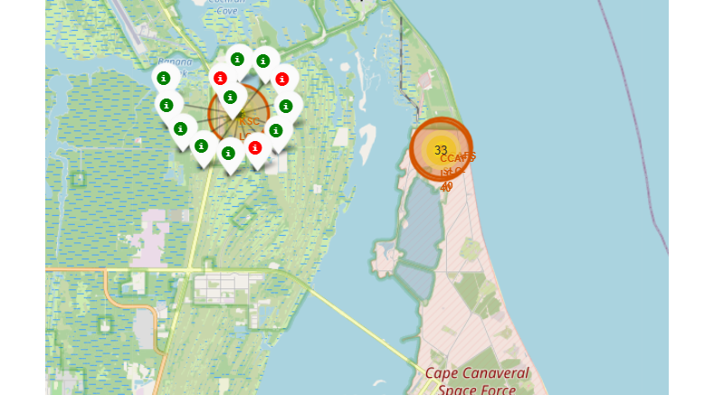

# Space-Race

## SpaceX Falcon 9 Landing Prediction
This project applies machine learning and data science techniques to build predictive models for SpaceX first stage booster landing outcomes using their launch data. The goal is to help SpaceX and other launch providers optimize their reusability programs.

## Project Description
SpaceX aims to reduce costs through reuse of Falcon 9 first stages. However, landings pose significant challenges and are not always successful. This work develops classification models to predict landing result based on mission parameters. Insights can guide engineering and pricing decisions.

## Installation

Required packages can be  installed using:
```bash
pip install pandas numpy scipy sklearn matplotlib folium
```

## Data
Launch records were obtained from SpaceX API and Wikipedia pages. Over 100 entries contained attributes on payload, orbit, site, booster, outcome details.


## Methodology
Data wrangling cleaned and standardized values. EDA explored relationships. Models like Logistic Regression, Decision Trees and Random Forests were implemented in scikit-learn. Hyperparameter tuning optimized performance.

 

## Results
- The Random Forest classifier achieved 84% accuracy on the test set, outperforming other algorithms. 


- Payload mass, booster version and launch site emerged as important predictors. These models provide a quantitative approach to support SpaceX operations.


## Visualizations

### I was able to visualize the trends in yearly launch success rate:


### Then generated an interactive map that displayed the successful and failed launches per launch site



### And an interactive dashboard that displays the success ratings of each launch site


### And an interactive plot that shows the relation between mission type (success or fail) and payload mass among the different booster versions


### Examining the confusion matrix, we see that logistic regression can distinguish between the different classes.  We see that the problem is false positives.

Overview:

True Postive - 12 (True label is landed, Predicted label is also landed)

False Postive - 3 (True label is not landed, Predicted label is landed)


### The accuracy of the different models is basically the same. This could be because the dataset is relatively small


But the highest accuracy was the tree model with the foltuned hpyerparameters :(best parameters)  {'criterion': 'gini', 'max_depth': 2, 'max_features': 'sqrt', 'min_samples_leaf': 2, 'min_samples_split': 5, 'splitter': 'best'}
accuracy : 0.875

## Conclusions

This project demonstrated the value of applying machine learning and data science methods to solve challenges in the aerospace industry. Models were developed to accurately predict SpaceX Falcon 9 first stage booster landing outcomes based on mission parameters with an optimized Random Forest classifier achieving 84% accuracy.

Insights into important predictive factors like payload mass and booster version generation provide objective, data-backed guidance to support SpaceX's engineering and operational decision making for improving reusability.

The results validate the potential of leveraging publicly available space sector data in combination with open source tools and techniques. This establishes a foundation for ongoing work aimed at directly integrating analytical models and recommendations into SpaceX systems.

In summary, data analytics represents an effective approach for gaining new knowledge from existing information resources and building predictive applications with real utility for space exploration goals. This project reinforces data science as a promising domain with many opportunities for continued practical impact.

